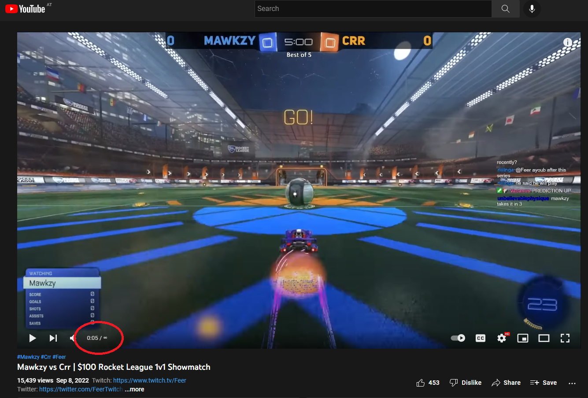

|logo| Infinity for Youtube
===========================

Hide duration of some youtube videos to avoid spoilers.

Screenshots
-----------

Features
--------

This extension hides video duration on youtube videos.
Unlike existing similar extensions, this doesn't hide the duration for all the videos,
but only for the videos in the selected YouTube channels.

Hiding the video duration is currently working in:

* the video player
* the recommended videos on the side-bar
* the YouTube homepage
* the search page
* a user's page.

You can hide/unhide the video length by clicking the ∞ symbol (total video length).

The extension is currently somewhat buggy; if a video length is not correctly hidden, 
please refresh the webpage.
Bug reports and fixes are more than welcome!

Install
-------

Development
+++++++++++

Clone the repo, and load the extension manually in `Chrome <https://www.smashingmagazine.com/2017/04/browser-extension-edge-chrome-firefox-opera-brave-vivaldi/#google-chrome-opera-vivaldi>`_.

Firefox is not currently available as it uses Manifest v3.
But it should be supported soon (follow progress `here <https://bugzilla.mozilla.org/show_bug.cgi?id=1578284>`_).

